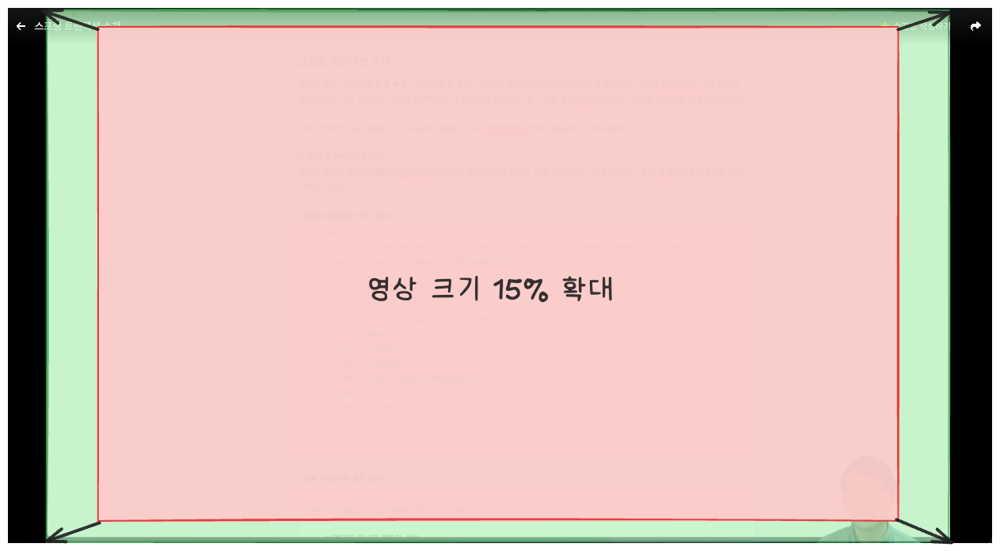

# Inflearn Video Enlarger

인프런 강의 페이지에서 영상을 확대하고 하단 바를 숨겨주는 Chrome 확장 프로그램입니다.



## 기능

- **영상 확대**: 100~120% 범위에서 조절 가능 (기본값: 105%)
- **하단 바 숨김**: 영상 하단 컨테이너 숨김 (기본값: ON)
- **중앙 정렬**: 화면 크기가 변해도 영상이 항상 중앙에 위치
- **자동 저장**: 모든 설정이 자동으로 저장되어 유지됨

## 설치

1. `chrome://extensions/` 접속
2. 개발자 모드 활성화
3. "압축해제된 확장 프로그램을 로드합니다" 클릭
4. `inflearn-large-video` 폴더 선택

## 사용법

1. 인프런 강의 페이지(`https://www.inflearn.com/courses/lecture`)로 이동
2. 확장 프로그램 아이콘 클릭하여 설정 조절
3. 설정은 즉시 적용되며 자동 저장됨

## 파일 구조

```
inflearn-large-video/
├── manifest.json    # 확장 프로그램 설정
├── content.js       # 영상 확대 로직
├── popup.html       # 설정 UI
└── popup.js         # 설정 관리
```

## 기술 스택

- Chrome Extension Manifest V3
- Chrome Storage API
- MutationObserver
- Vanilla JavaScript
